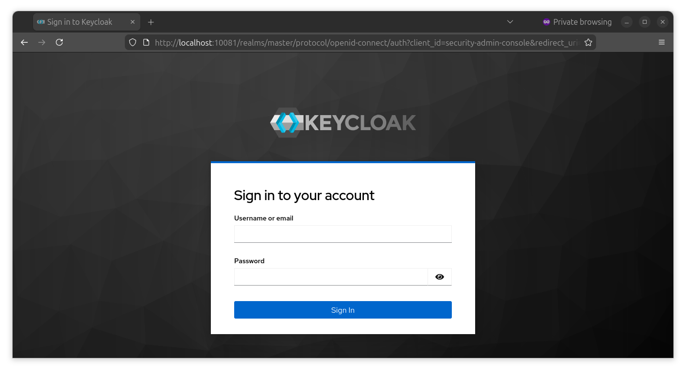
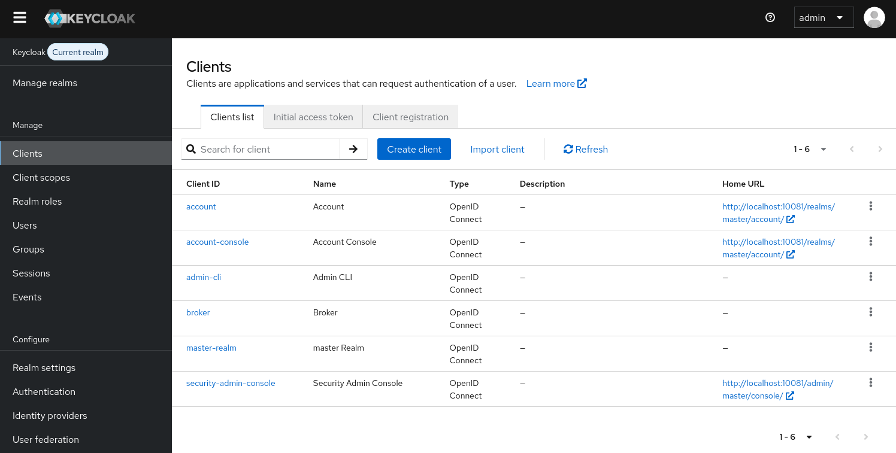
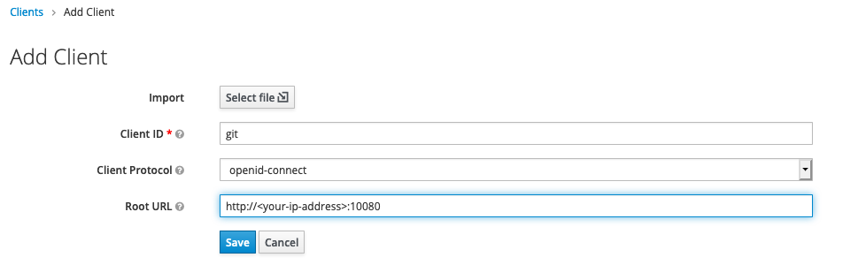
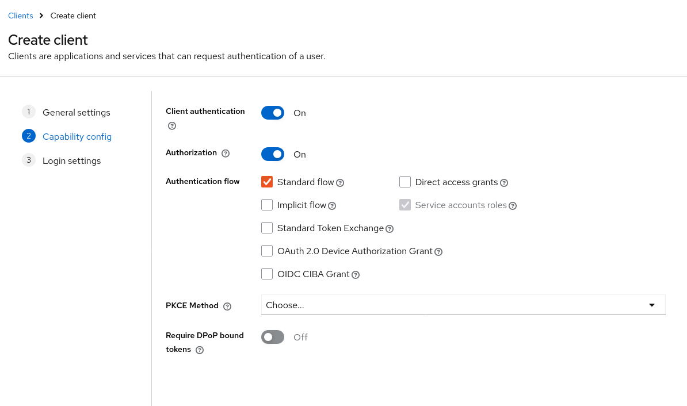
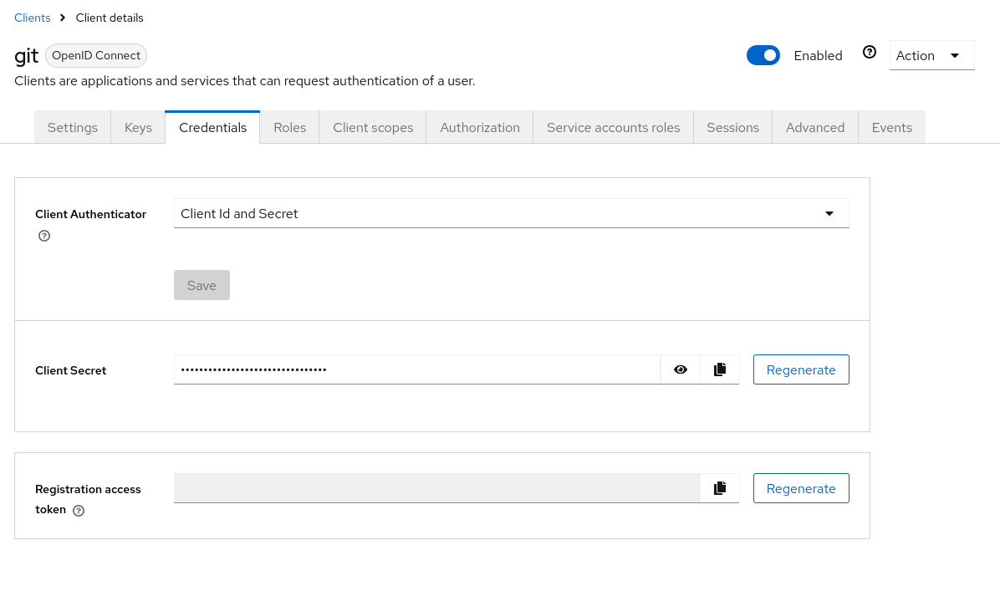
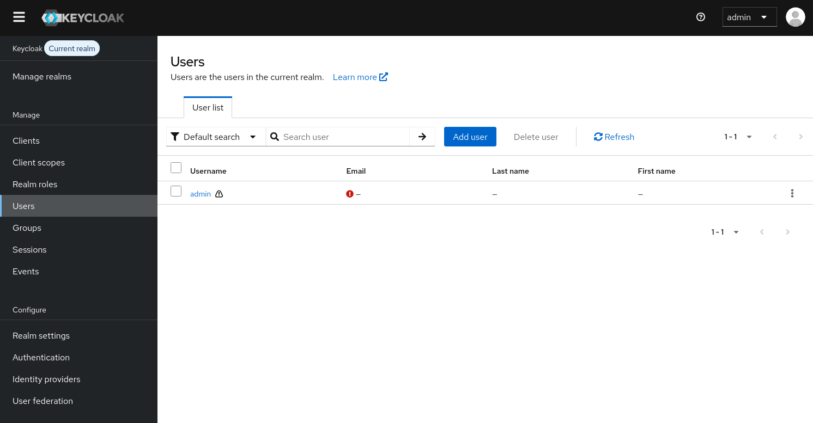
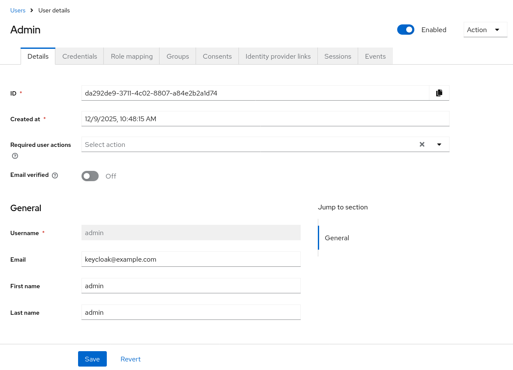
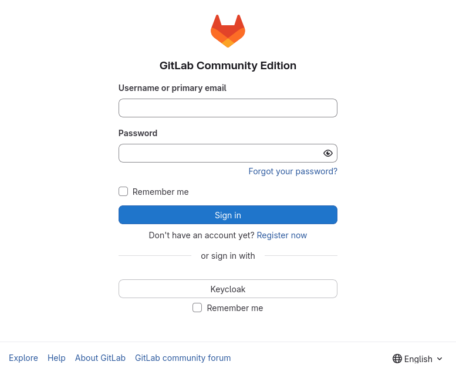

# Integrate Keycloak as a IDP with GitLab

In this document, we will explain how to set up Keycloak and integrate it into GitLab.

## Setting up Keycloak

First, you need a client in Keycloak to authenticate with GitLab. You can start Keycloak by running `docker-compose up -d keycloak`.

When Keycloak is running, log in using the `Administration console`. You can visit the Keycloak on the [local IP](http://localhost:10081) of your laptop.



Next, create a client.



Fill in the following variables:



Make access type confidential and enable service accounts and authorization.



Next, click save, get the client secret generated by Keycloak and start filling out the variables for GitLab in the docker-compose file.



```yaml
    - OAUTH2_GENERIC_APP_SECRET=<your-client-secret>
    - OAUTH2_GENERIC_CLIENT_SITE=http://<your-ip-address>:10081
    - OAUTH2_GENERIC_CLIENT_USER_INFO_URL=http://<your-ip-address>:10081/auth/realms/master/protocol/openid-connect/userinfo
    - OAUTH2_GENERIC_CLIENT_AUTHORIZE_URL=http://<your-ip-address>:10081/auth/realms/master/protocol/openid-connect/auth
    - OAUTH2_GENERIC_CLIENT_TOKEN_URL=http://<your-ip-address>:10081/auth/realms/master/protocol/openid-connect/token
    - OAUTH2_GENERIC_CLIENT_END_SESSION_ENDPOINT=http://<your-ip-address>:10081/auth/realms/master/protocol/openid-connect/logout
```

Make sure the following variables are filled in the docker-compose file:

```yaml
    - GITLAB_HOST='<your-ip-address>'
    ...
    - OAUTH_ENABLED=true
    - OAUTH_AUTO_SIGN_IN_WITH_PROVIDER=Keycloak
    - OAUTH_ALLOW_SSO=Keycloak
    - OAUTH_BLOCK_AUTO_CREATED_USERS=false
    - OAUTH_AUTO_LINK_LDAP_USER=false
    - OAUTH_AUTO_LINK_SAML_USER=false
    - OAUTH_EXTERNAL_PROVIDERS=Keycloak
```

GitLab does not allow login from users in Keycloak with an empty email or name. To prevent this, you can create a new user in Keycloak or you can add email and name for the admin account.

Visit the `Users` tab and click on `View all users` to modify the Admin user.



Modify the `Email`, `First name` and `Last Name` fields.


Deploy GitLab, Reddis and PostgreSQL by running the following command: `docker-compose up -d gitlab redis postgresql`.

You can now login on the local GitLab instance with with Keycloak on your [local IP](http://localhost:10080).

